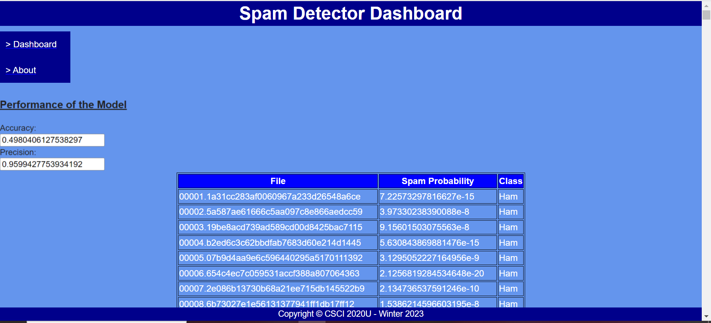

# Spam Detector

## Project Information
Group Members: Almas Alam, Anthony Gutierrez, Justin Li

This project is a creation of a Spam Detector algorithm, used to filter out unwanted spam messages and wanted ham messages from a client's inbox. This algorithm performs the calculations to find the accurate and precise methods to figure out which emails are designated as spam or are true emails.  

The following pictures show the data analysis:

## Improvements 
When creating the html interface, our goal was to make it simple and easy to use/navigate. All relevant testing/measurement information are clearly displayed on large tables centered in the middle of the page for easy viewing. The color palette and font are all consistent between the html pages, making traversal seamless. We made a separate section to provide an about page for reference as well as added animation.

## How to Run
- Copy and paste the following url into your web browser: https://github.com/Anthonygtz/SpamDetector.git
- This should lead to the github repository containing all relevant code to run the Spam Detector
- Launch a terminal (ex: Git Bash, Anaconda Prompt, etc.)
- Change directory into the one you wish to clone the project in
- Use the 'git clone' command to clone this repository onto your local machine using the link above (ex: 'git clone https://github.com/Anthonygtz/SpamDetector.git')
- Once the repository has been cloned, launch IntelliJ and open the repository folder
- Look on the left of IntelliJ to see the file structure of the project
- Navigate to the 'SpamResource.java' file, located through 'spamDetectorServer/src/main/java/com.spamdetector/service/SpamResource.java'
- At the top toolbar, click 'Run', then 'Edit Configurations'
- Add a new glassfish local server configuration
- Under 'Deployments', create a 'war:exploded' artifact for deployment
- Under the 'Server' tab, set the server domain to 'domain1'
- Change the URL to include /api/spam at the end (ex: http://localhost:8080/spamDetector-1.0/api/spam)
- Click 'apply', then run the glassfish server (you will know the server is running when your web browser opens a webpage)
- Once the server is running, open and run the 'index.html' file, located through 'spamDetectorClient/index.html'
- This will open an html webpage, containing all relevant spam percentages for a list of messages, as well as the accuracy and precision of the algorithm
- When finished, turn off the glassfish server and close IntelliJ

## Other Resources
SpamDetector.java Libraries
- java.io.*
- java.util.*

TestFile.java Libraries
- java.text.DecimalFormat
- com.fasterxml.jackson.annotation.JsonProperty

SpamResource.java Libraries
- com.fasterxml.jackson.core.JsonProcessingException
- com.spamdetector.domain.TestFile
- com.spamdetector.util.SpamDetector
- jakarta.ws.rs.GET
- jakarta.ws.rs.Path
- jakarta.ws.rs.Produces
- java.io.File
- java.io.IOException
- java.net.URISyntaxException
- java.net.URL
- java.util.List
- jakarta.ws.rs.core.Response
- com.fasterxml.jackson.databind.ObjectMapper
